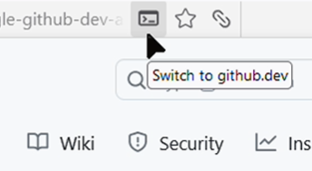
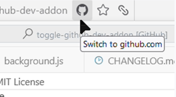

#  Toggle Github.Dev

This simple Firefox addon adds a URL button to quickly toggle github.dev view of the repository. It shows "Switch to github.dev" button when you're on any "github.com" page, and vice verse. 

